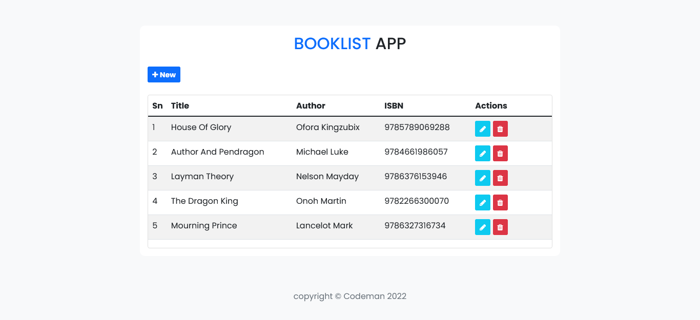

# Booklist App

## Table of contents

- [Frontend Mentor - Intro component with sign up form solution](#frontend-mentor---intro-component-with-sign-up-form-solution)
  - [Table of contents](#table-of-contents)
  - [Overview](#overview)
    - [Screenshot](#screenshot)
    - [Links](#links)
  - [My process](#my-process)
    - [Built with](#built-with)
  - [Author](#author)

## Overview

Users should be able to:

- View the optimal layout for the site depending on their device's screen size
- Add new book to the list
- Update existing book in the list
- Delete book from the list

### Screenshot

### Links

- Live Site URL:[booklist-app](https://nodejs-booklist-app.herokuapp.com/)

## My process

### Built with

- Semantic HTML5 markup
- CSS custom properties
- Bootstrap
- Nodejs
- Express Js
- Javascript

## Author

- Facebook - [kingsley.aham.1](https://www.facebook.com/kingsley.aham.1)
